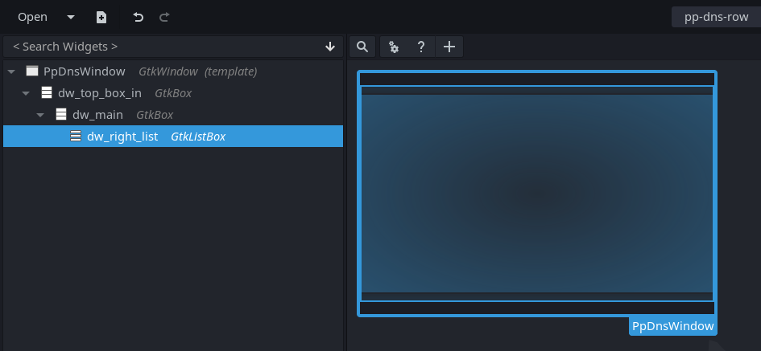
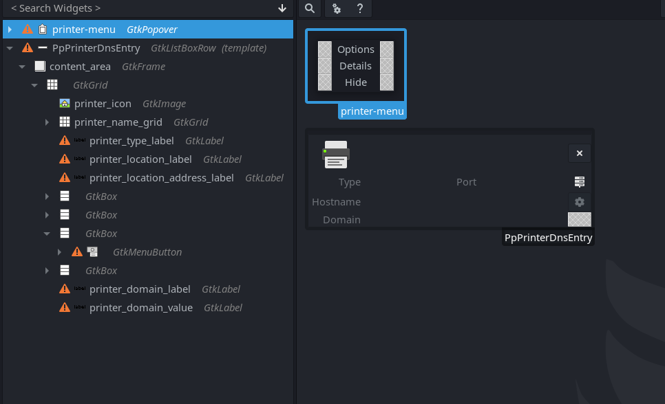
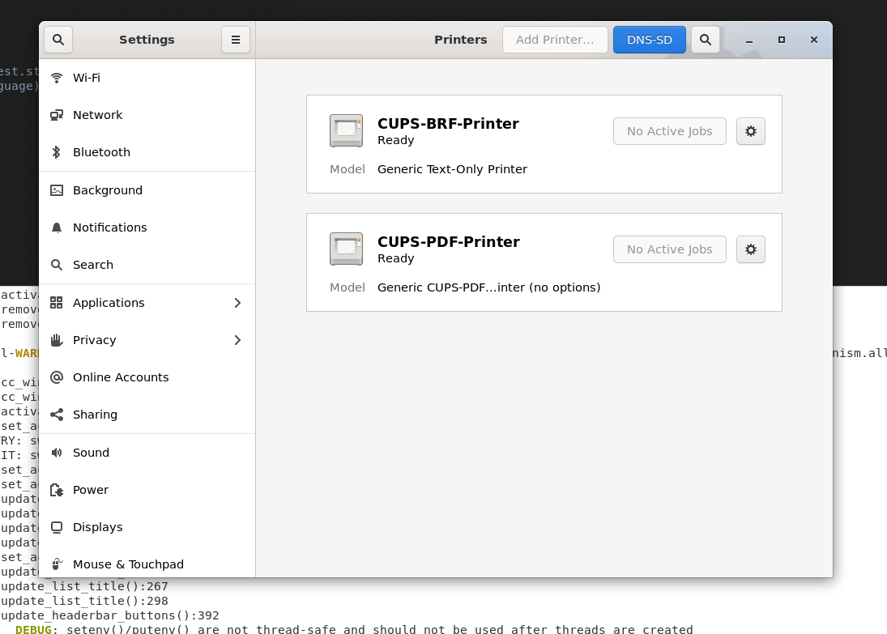

# Project 
Title : GUI for listing and managing available IPP Print/Scan services (or DNS-SD-advertised network services in general)

Description : 
These project is a combination of the gtk+  frontend library and the avahi-client backend. Using these 2 technologies I built an easily accessible tool housed in the gnome-control-center that can list all the available ipp(s) and http(s) services broadcasted on a network. The network printing architecture requires people to get used to such services as network printers are broadcasted using these ipp services. 

DNS-SD has been around for quite sometime now but most of the users are unaware of such services being broadcasted. This tool can list all such services with a click of a button. It does'nt just list them but also removes duplicates from different network interfaces, and also allow you to navigate to their respective administration website url. This makes using these services very user friendly.

# Implementation details 

The first challenge I faced was that of learning the gtk frontend using C and then design the UI for this tool. I decided to settle with a small button in the printing panel that opens another window where this list is going to be displayed as this design did'nt take a lot of space in the already present printing panel and helped segregate things for the user. After creating this window adding a list to it, I converted this window into a composite widget. Then I integerated avahi-client into this composite widgets. After successfully integerating the client in a threaded mode, I wrote apis for the widget to facilated the listing of services using avahi and coded the callbacks for removing/hiding these services.
The files that I created in this process were as follows-
* pp-dns-window.c
* pp-dns-window.h
* pp-dns-window.ui
* pp-dns-row.c
* pp-dns-row.h
* pp-dns-row.ui

I will now go through all these file and their purpose along with some code samples to illustrate important functionalities.

One would observe that the these files comes in a set of 3 , i.e. *".c"*,*".h"*,*".ui"* , this is because these files together construct a composite widget in gtk. The .ui file is an xml for the layout of different widgets inside  this composite widget. 

We will be needing composite widget for each service entry of the list as they are new instances of the same class of widgets. I also made the window housing this list a composite widgets( a simple GTK_WINDOW would also work ) as I did'nt want to make a lot of changes to the base cc-printers-panel.c file which represent the printers panel. This made sure that the avahi client is only integerated in this top-level window and not the g-c-c printer panel. Therefore avahi client is initialized and run only when this top-level window pops up from the printer panel and not every time the printer panel is opened.

## pp-dns-window .ui .c .h

The design for this window in glade is very simple and looks something like



This is pretty much an empty window with a single widget housed, i.e. is a GtkListBox. This listbox will have the services added into it when discovered by avahi client.

Now the avahi client adds the services into this list after it finishes resolving it. The code segment for it something like 
```C
case AVAHI_RESOLVER_FOUND:
    {
        char* admin_url = NULL;

        AvahiStringList* list = avahi_string_list_find( txt, "adminurl" );
        // PART - 1    
      /* If the key adminurl is found in the TXT records */
        if ( list != NULL){
          char* key, * value;

          avahi_string_list_get_pair( list, &key, &value, NULL );
          admin_url = g_strdup( value );

          avahi_free( key );
          avahi_free( value );
        }

        gchar* service_name_unique = g_strjoin(":",name,type,domain, NULL);

        // PART - 2
        if (  g_hash_table_lookup (self->service_hash_table, service_name_unique) == NULL){

          PpPrinterDnsEntry* row_list = pp_printer_dns_entry_new ( name, type, domain, host_name, port_str, admin_url , self->is_authorized);

          gtk_widget_show ((GtkWidget*)row_list);
          g_hash_table_insert (self->service_hash_table, service_name_unique, row_list);
          gtk_list_box_insert (self->dw_right_list,GTK_WIDGET (row_list), -1);
        }

        // PART - 3
        char a[AVAHI_ADDRESS_STR_MAX], *t;
        g_fprintf(stderr, "Service '%s' of type '%s' in domain '%s':\n", name, type, domain);
        avahi_address_snprint(a, sizeof(a), address);
        t = avahi_string_list_to_string(txt);


        g_fprintf(stderr,
                "\t%s:%u (%s)\n"
                "\tTXT=%s\n"
                "\tcookie is %u\n"
                "\tis_local: %i\n"
                "\tour_own: %i\n"
                "\twide_area: %i\n"
                "\64tmulticast: %i\n"
                "\tcached: %i\n",
                host_name, port, a,
                t,
                avahi_string_list_get_service_cookie(txt),
                !!(flags & AVAHI_LOOKUP_RESULT_LOCAL),
                !!(flags & AVAHI_LOOKUP_RESULT_OUR_OWN),
                !!(flags & AVAHI_LOOKUP_RESULT_WIDE_AREA),
                !!(flags & AVAHI_LOOKUP_RESULT_MULTICAST),
                !!(flags & AVAHI_LOOKUP_RESULT_CACHED));
        avahi_free(t);
    }
```
Here,

**Part 1** checks if the url for the admin interface for this service is present inside the TXT record entry for this service. If found, then it set the value of admin_url from NULL to the found value. This value is later passed on to create a new list entry for the service in Part 2

**Part 2** uses a hash table to ensure that the services being added to the list are all unique and not duplicates from different network interfaces. Here we assume that a service is unique if it has the 3 parameters - name , type and domain all unique. After performing this check the service widget is created using 
>PpPrinterDnsEntry* row_list = pp_printer_dns_entry_new ( name, type, domain, host_name, port_str, >admin_url , self->is_authorized);

This creates a new instance of a widget of the type PpPrinterDnsEntry( composite ) and then add this widget into a gtklistbox as follows
>gtk_list_box_insert (self->dw_right_list,GTK_WIDGET (row_list), -1);


**Part 3** is used to print the output for the avahi client's resolved service's data into the stderr stream. We can remove this if we want but it is quite usefull when debugging.

Apart from the above mentioned code, another important part of this file is the start_avahi_in_background function
```C
static void start_avahi_in_background(PpDnsWindow *self){
  int error;


  /* Optional: Tell avahi to use g_malloc and g_free */
  avahi_set_allocator (avahi_glib_allocator ());

  /* Create the threaded poll Adaptor */
  self->avahi_threaded_poll = avahi_threaded_poll_new ();
  self->poll_api = avahi_threaded_poll_get (self->avahi_threaded_poll);

  /* Create a new AvahiClient instance */
  self->client = avahi_client_new (self->poll_api,  /* AvahiPoll object from above */
                               0,
            avahi_client_callback,                  /* Callback function for Client state changes */
            NULL,                                   /* User data */
            &error);                                /* Error return */

  /* Check the error return code */
  if (self->client == NULL)
  {
      /* Print out the error string */
      g_warning ("Error initializing Avahi: %s", avahi_strerror (error));
      destroy(self);
  }

  AvahiServiceBrowser *sb_ipps = NULL;
  /* Create the service browser */
  if (!(sb_ipps = avahi_service_browser_new(self->client, AVAHI_IF_UNSPEC, AVAHI_PROTO_UNSPEC, "_ipps._tcp", NULL, 0, browse_callback, self)))
  {
      g_fprintf(stderr, "Failed to create service browser: %s\n", avahi_strerror(avahi_client_errno(self->client)));
      destroy(self);
  }

  AvahiServiceBrowser *sb_ipp = NULL;
  /* Create the service browser */
  if (!(sb_ipp = avahi_service_browser_new(self->client, AVAHI_IF_UNSPEC, AVAHI_PROTO_UNSPEC, "_ipp._tcp", NULL, 0, browse_callback, self)))
  {
      g_fprintf(stderr, "Failed to create service browser: %s\n", avahi_strerror(avahi_client_errno(self->client)));
      destroy(self);
  }

  AvahiServiceBrowser *sb_http = NULL;
  /* Create the service browser */
  if (!(sb_http = avahi_service_browser_new(self->client, AVAHI_IF_UNSPEC, AVAHI_PROTO_UNSPEC, "_http._tcp", NULL, 0, browse_callback, self)))
  {
      g_fprintf(stderr, "Failed to create service browser: %s\n", avahi_strerror(avahi_client_errno(self->client)));
      destroy(self);
  }

  AvahiServiceBrowser *sb_https = NULL;
  /* Create the service browser */
  if (!(sb_http = avahi_service_browser_new(self->client, AVAHI_IF_UNSPEC, AVAHI_PROTO_UNSPEC, "_https._tcp", NULL, 0, browse_callback, self)))
  {
      g_fprintf(stderr, "Failed to create service browser: %s\n", avahi_strerror(avahi_client_errno(self->client)));
      destroy(self);
  }

  /* Make a call to get the version string from the daemon */
  self->version = avahi_client_get_version_string (self->client);

  /* Check if the call suceeded */
  if (self->version == NULL)
  {
      g_warning ("Error getting version string: %s", avahi_strerror (avahi_client_errno (self->client)));
      destroy(self);
  }
  g_message ("Avahi Server Version: %s", self->version);

  /* Finally, start the event loop thread */
  avahi_threaded_poll_start(self->avahi_threaded_poll);
}
```
This funtion creates a threaded avahi_poll and also initializes service browsers( after initializing the client ) for different service types like "https","ipps" . We can easily add support for other types of service by adding another service browser here( tested with ftp ). 

### Important APIs created 
```C
// for creating a new instance of the widget
PpDnsWindow* pp_dns_window_new()

// for initializing and configuring the widget to use avahi client 
static void pp_dns_window_init(PpDnsWindow *self)

// to run avahi
static void start_avahi_in_background(PpDnsWindow *self)

// callback for avahi service browser
static void browse_callback(
    AvahiServiceBrowser *b,
    AvahiIfIndex interface,
    AvahiProtocol protocol,
    AvahiBrowserEvent event,
    const char *name,
    const char *type,
    const char *domain,
    AVAHI_GCC_UNUSED AvahiLookupResultFlags flags,
    PpDnsWindow *self)

// callback for avahi service resolver
static void resolve_callback(
    AvahiServiceResolver *r,
    AVAHI_GCC_UNUSED AvahiIfIndex interface,
    AVAHI_GCC_UNUSED AvahiProtocol protocol,
    AvahiResolverEvent event,
    const char *name,
    const char *type,
    const char *domain,
    const char *host_name,
    const AvahiAddress *address,
    uint16_t port,
    AvahiStringList *txt,
    AvahiLookupResultFlags flags,
    AVAHI_GCC_UNUSED PpDnsWindow *self)

```


This widget therefore can be summed up to perform the following tasks-
* House the list for the services
* Initialize and run the avahi-client in the background as a threaded poll. 


## pp-dns-row .ui .c .h

This widget is used to represent a single service and list's all the important details about this service. The design for this widget in glade looks like


This widget uses the information fed to it by pp-dns-window's avahi resolve callback to populate all the details like Name, Type, Port, Hostname etc.

This widget has a link button that will be made clickable only when the web interface for a particular service is available. This url will either be passed down by pp-dns-window or itself be created by the widget if the service type is http(s)

### Important APIs created - 

```C

// used to create a new instance
PpPrinterDnsEntry *pp_printer_dns_entry_new  (char* name, char* type, char* domain, char* hostname, char* port,char* admin_url,
                                       gboolean    is_authorized);

// to get important details about a widget instance  
const gchar* pp_dns_printer_entry_get_name(PpPrinterDnsEntry *self);
const gchar* pp_dns_printer_entry_get_type(PpPrinterDnsEntry *self);
const gchar* pp_dns_printer_entry_get_hostname(PpPrinterDnsEntry *self);
const gchar* pp_dns_printer_entry_get_domain(PpPrinterDnsEntry *self);
const gchar* pp_dns_printer_entry_get_port(PpPrinterDnsEntry *self);

// to remove the service from the list( more like hide and not actual remove)
void  pp_dns_printer_entry_remove_service(PpPrinterDnsEntry *self );

// to populate a widget with information about a service recieved from avahi
void  pp_printer_dns_entry_update (PpPrinterDnsEntry *self,
                                         char* name, char* type, char* domain, char* hostname, char* port,
                                         char* admin_url, gboolean        is_authorized);

```


# Integeration into the gnome-control-center

This window will be triggered inside the printers panels for g-c-c. A button with the label of "DNS-SD" is placed on top of this window( as shown in the image below ) and the callback for which is defined as follows -

```C
static void
dns_sd_button_cb(CcPrintersPanel *self){
  GtkWidget* dns_window = (GtkWidget*) pp_dns_window_new();
  gtk_widget_show (GTK_WIDGET (dns_window));
}

```
This will create a new widget instance of the class pp-dns-window defined in the pp-dns-window.h header.


